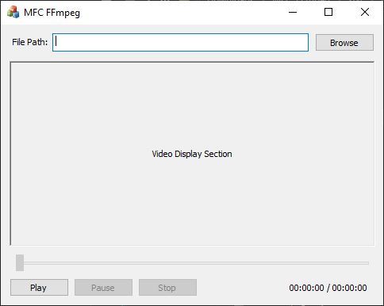

# MFC-FFmpeg
MFC dialog built with FFmpeg and SDL2 libraries.

## Description
This project is created with Visual Studio 2019. This project is built with FFmpeg and SDL2 shared libraries.
Because FFmpeg only provides 64-bit libraries, this project only support 64-bit platform.
Due to licenses and copyrights, I wouldn't include those libraries in this project source files. But you could add them by yourself according to the instructions below.

## Screenshot

## Libraries Version
* VS2019 Windows SDL Version: 10.0 (latest installed version)
* VS2019 Platform Toolset: Visual Studio 2019 (v142)
* FFmpeg: ffmpeg-4.3.2-2021-02-02-full_build-shared
* SDL2: SDL2-devel-2.0.14-VC

## Usage Instructions
To open this project without any error, you have to add FFmpeg and SDL2 shared libraries.
You could try newest ones of FFmpeg and SDL2, but I couldn't make sure they would work properly.
Steps as below:
1. Pull source files to your local drive;
2. In the root folder of source files, make a folder called 'include' and Make another folder called 'lib';
3. In the root folder of source files, make a folder called 'x64'. And in 'x64' folder, make a folder called 'Release';
4. Download latest FFmpeg release full shared build: https://www.gyan.dev/ffmpeg/builds/ffmpeg-release-full-shared.7z . From this '7z' file, copy those files in 'include' folder to our 'include' folder and copy those files in 'lib' folder to our 'lib' folder. And copy those 'dll' files in 'bin' folder to our 'x64/Release' folder;
5. Download SDL2 development VC libraries: https://www.libsdl.org/release/SDL2-devel-2.0.14-VC.zip . From this 'zip' file, copy those files in 'include' filder to our 'include/SDL2' folder. Copy the 'lib' files in the 'lib/x64' folder to our 'lib' folder and copy the 'dll' file in the 'lib/x64' folder to our 'x64/Release' folder.
6. Now open this project with VS2019, you should not see any errors when building and running.

**If you only downloaded the release file, you still need those 'dll' files mentioned above. Just place them in the same folder with the 'exe' file.**

## Reference
* https://blog.csdn.net/qq_29350001/article/details/76432553
* https://blog.csdn.net/ciellee/category_10331352.html

## License
This project is created by me and with the help of FFmepg and SDL2 shared libraries.
Those source files included in this github repository is according to MIT. But when you add FFmpeg and SDL2 libraries, please follow their copyrights.
