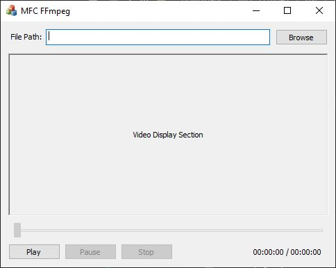

English version: [README.md](README.md)

# MFC FFmpeg
建立于FFmpeg和SDL2库基础上的MFC对话框。

## 介绍
本项目使用Visual Studio 2019创建，使用了FFmpeg和SDL2的共享运行库。
由于FFmpeg只提供了64位的运行库，所以本项目仅支持64位平台。
根据相关许可和版权，我没有将FFmpeg和SDL2的文件收录于本项目，但您可以根据下面的步骤自行添加。

## 截图

## 库文件版本
* VS2019 Windows SDL Version: 10.0 (latest installed version)
* VS2019 Platform Toolset: Visual Studio 2019 (v142)
* FFmpeg: ffmpeg-4.3.2-2021-02-02-full_build-shared
* SDL2: SDL2-devel-2.0.14-VC

## 使用步骤
必须添加FFmpeg和SDL2的共享运行库，才能使本项目打开运行时无报错。
您也可以尝试最新版本的FFmpeg和SDL2运行库，但我无法保证本项目可正常打开运行。
步骤如下:
1. 将本项目源文件下载至本地；
2. 在项目源文件根目录下，创建名为“include”和“lib”的文件夹，在“include”文件夹下，再创建一个名为“SDL2”的文件夹；
3. 在项目源文件根目录下，创建名为“x64”的文件夹，在该文件夹下再创建一个名为“Release”的文件夹；
4. 下载FFmpeg release full shared build： https://www.gyan.dev/ffmpeg/builds/packages/ffmpeg-4.3.2-2021-02-02-full_build-shared.7z 。
从该“7z”文件中，将“include”文件夹下的文件，复制到源文件“include”文件夹下，将“lib”文件夹下的文件，复制到源文件“lib”文件夹下，将“bin”文件夹下的“dll”文件，复制到源文件“x64/Release”文件夹下；
5. 下载SDL2开发版VC运行库: https://www.libsdl.org/release/SDL2-devel-2.0.14-VC.zip 。
从该“zip”文件夹中，将“include”文件夹下的文件，复制到源文件“include/SDL2”文件夹下，将“lib”文件夹下的“lib”文件，复制到源文件“lib”文件夹下，将“lib”文件夹下的“dll”文件，复制到源文件“x64/Release”文件夹下；
6. 现在使用VS2019打开项目文件并编译时，将不会看到任何报错。

**如果您只下载了Release文件，仍需要上文中提到的“dll”文件才能运行，仅需将它们与exe放到相同的目录下即可。**

## 参考
* https://blog.csdn.net/qq_29350001/article/details/76432553
* https://blog.csdn.net/ciellee/category_10331352.html

## 许可
本项目是我创建的，但是使用了FFmpeg和SDL2的共享运行库。
本Github项目目录下的源文件遵从MIT，但是一旦您添加了FFmpeg和SDL2的运行库，请遵从他们的许可和版权。
